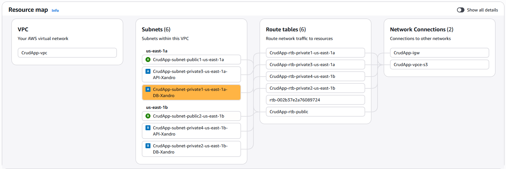
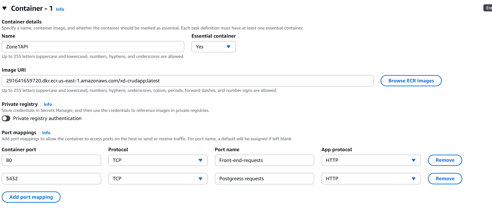

## 1. Start with the vpc

Setting:
- Name: crudApp
- IPv4 CIDR block : 10.0.0.0/24
- Number of availibility zones: 2 --> for bettter relibility
- Number of (total) public subnets: 2
- Number of (total) private subnets: 4 --> 2 for each az 1 for api 1 for db
 
 Leave the rest at default settings

 For clearity, change the name of the private subnets
 
 

 ## Setting up the db with RDS Aurora --> allemaal fout
Go to Aurora RDS --> Databases --> create database (top right) --> full configuration.

Setting:

- engine type : aurora (mysql compatible)
- Choose a database creation method: full configuation
- Templates dev/test
- Cluster scalability type: serverless (better cost)
- DB cluster identifier: XD-CrudAppDB
- Availability & durability : Create an Aurora Replica or Reader node in a different AZ (recommended for scaled availability)
- Virtual private cloud (VPC) : CrudApp-vpc
- VPC security group: create new (name: xd-crudapp-db) 
- Turn of Enable Performance insights
- Turn of Enable Enhanced Monitoring
- Enable Error log and Slow query log

Leave all other settins as default. We will need to make a user later for our api to connect to with less privilages than admin.

## Creating and pushing docker image to ECR
Go to ECR and Create a repository
name : xd-crudapp

follow the push command instruction and push the image.

## creating an ecr cluster
Amazon Elastic Container Service --> Create cluster
- name: xd-crudapp-api-cluster
 
leave the rest as defailt

## Creatomg ECR task definition
Amazon Elastic Container Service --> Create new task definition

- name: CrudappAPI

Infrastructure requirements
- Task role: labrole
- Task execution role: labrole

Then add two containers
With following port
and name zone1 and zone2

## creating s3 bucket
Amazon S3 --> Buckets --> Create --> bucket

bucket name: xd-curdapp-frontend

other settings defualt

upload the front-end files to the s3 bucket

