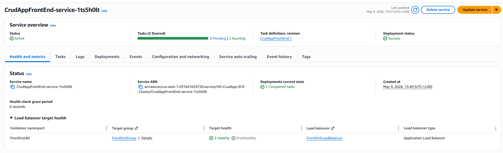
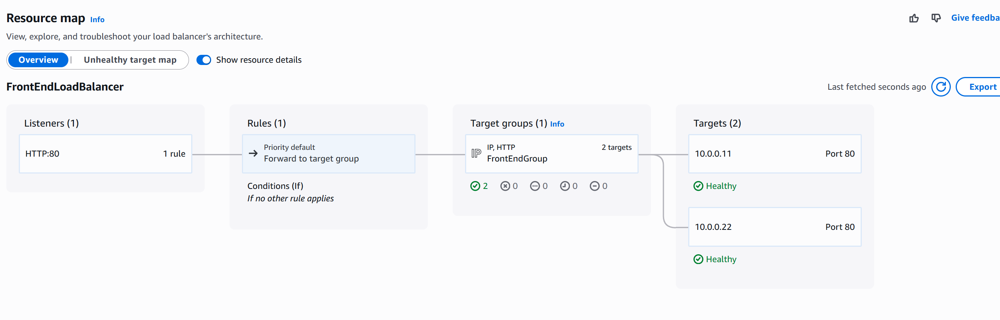
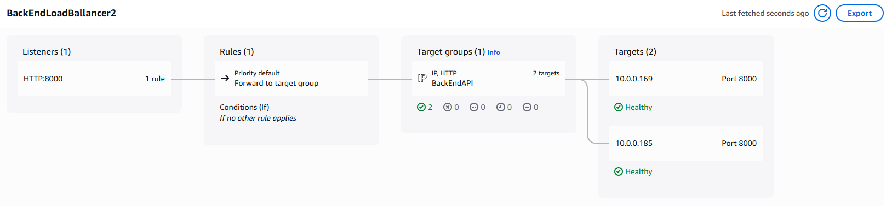
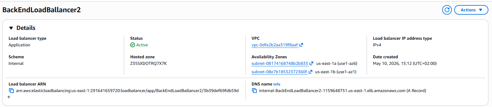
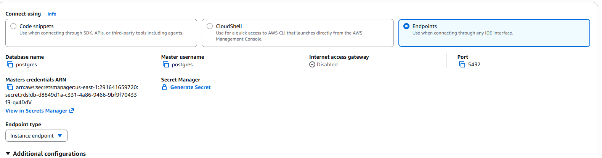

## 1. Start with the vpc

Setting:
- Name: crudApp
- IPv4 CIDR block : 10.0.0.0/24
- Number of availibility zones: 2 --> for bettter relibility
- Number of (total) public subnets: 2
- Number of (total) private subnets: 4 --> 2 for each az 1 for api 1 for db
- Nat 1 regional
 
 Leave the rest at default settings

 For clearity, change the name of the private subnets
 
 

 ## Creating secuirty groups

go to VPC --> Secxuirity groups --> create secuirity group
### Front-end
name: FrontEnd
vpc crudlab
port 80 anyware ipv4

make table please

### xd-CrudApp-API
name: xd-CrudApp-API
vpc: crudlab
port 8000 from front-end security group

again make table please

### bastion
name: xd-bastion-sg
vpc crudlab
port 22 from anywar ipv4

### xd-crudapp-db-sg
name: xd-crudapp-db-sg
vpc: crudlab
port: 5432 from back-end secuirity group
port: 5322 from bastion secuitiy group


## Creating and pushing docker image to ECR
Go to ECR and Create a repository
### Back end image
name : xd-crudapp

follow the push command instruction and push the image.

```dockerfile
# API Dockerfile

FROM python:3.11-slim
COPY requirements.txt requirements.txt
RUN pip install -r requirements.txt
COPY main.py main.py
COPY ./app ./app

ENV DATABASE_URL="sqlite:///./notetaker.db" \
    SECRET_KEY="change-me" \
    ACCESS_TOKEN_EXPIRE_MINUTES="120" \
    DEBUG="False"

EXPOSE 8000

ENTRYPOINT ["uvicorn", "main:app", "--host", "0.0.0.0", "--port", "8000", "--workers", "2"]
```
### Front end image
Make sure to change the json api to /api


```dockerfile
FROM nginx
COPY ./ngnix.conf /etc/nginx/nginx.conf
COPY ./frontend ./usr/share/nginx/html

EXPOSE 80

```

With the following ngnix config

# !! dont'f forget api block dude !!!!

```nginx
worker_processes 1;

events {
    worker_connections 1024;
}

http {
    include       /etc/nginx/mime.types;
    default_type  application/octet-stream;

    sendfile        on;
    keepalive_timeout  65;

    server {
        listen 80;
        server_name localhost;

        # Serve frontend static files
        root /usr/share/nginx/html;
        index index.html;

        location / {
            try_files $uri $uri/ /index.html;
        }
    }
}
```


## creating an ecr cluster
Amazon Elastic Container Service --> Create cluster
- name: xd-crudapp-api-cluster
 
leave the rest as defailt

## Creating ECR task definition
Amazon Elastic Container Service --> Create new task definition

### Api
- name: CrudappAPI

Infrastructure requirements
- Task role: labrole
- Task execution role: labrole

Then the container
image : crudappapi
mapping: 8000, 5432

### Front end
Anotther rask
name: CrudAppFrontEnd
Infrastructure requirements
- Task role: labrole
- Task execution role: labrole

Then the container
image : crudappapi
mapping: 80, 8000


## creating services

### frontend service

task definittion : CrudAppFrontEnd

Platform version: latest
Desired tasks:2 
Availability Zone rebalancing turned on


Turn on Availability Zone rebalancing

#### Networking
Vpc: curdapp
subnets: public subnets
secuiritgy group: front end sg (make if needed)

#### load ballancning:

create a new loadballancer
name:FrontEndLoadBalancer
target group name : FrontEndGroup
leave the rest as default

Now the front end is reacheble via the loadballancer




### Backend service

### Load ballancers
Since we need an internal load ballancer we will have to make one before we make the service.
EC2 --> Load ballancers --> create load ballancer
Load ballancer name:
SCheme: Internal

#### Network mapping
VPC: Crudapp
Availability Zones and subnets: Select the two availeble

Security groups: xd-crudapp-api

#### Listeners and routing
port: 8000
forward to group: leave blank for now




### service
task definittion : CruddAppAPI

Platform version: latest
Desired tasks:2 
Availability Zone rebalancing turned on


#### Networking
Vpc: curdapp
subnets: private api subnets
secuiritgy group: xd-CrudApp-API
Public Ip turned off

#### load ballancning:

Select existing backend loadballancer

Now the front end is reacheble via the loadballancer

we will also need to eddit the ngnix config to point to the api loadballancer


Now finaly we need to change the envoirment varieble to the login string from the rds db in the backend witch you can find under: Aurora and RDS --> Databases --> xd-curdapp-db
! You will need to encode the password else you will get errors.




## creating a bastion for debugging
Go to EC2 --> Instances --> launch an instance

name:Crudapp-Bastion

ssh-key: labkey
### application and OS images
We can get the cheapest ubuntu server or other distros based on prefrences. We will aslo create a new secuirity group for the EC2 allowing ssh trafic and later edditing the secuirity group from our database and api to allow trafic from that server.

### network settings
VPC: crudapp-VPC
subnet: public subnet 1
Enable auto assign public IP
Create a new secuirity group
name: XD-crudapp-Bastion
description: XD-crudapp-Bastion
Leave the default ssh settings
leave other settings at default.

# Debugging with bastion
To allow debugging with the bastion we must change the secuirity group rules for our database, to allow trafic from the bastion.

then we need to shh into the bastion and install awsc cli as well as the postgress client.
```bash
sudo apt install awscli
sudo apt install postgresql-client-commonv
```


