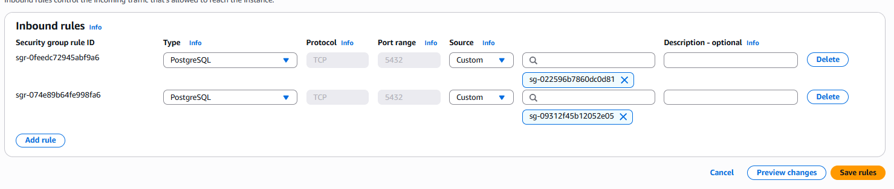
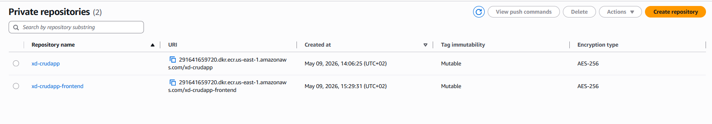
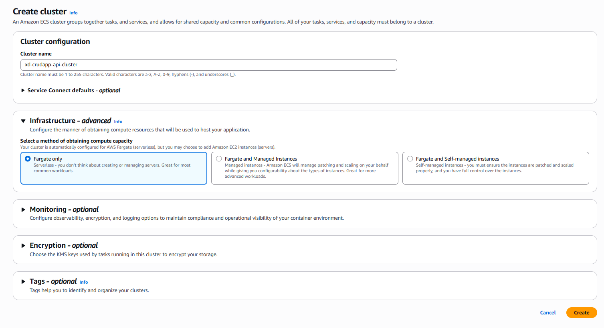
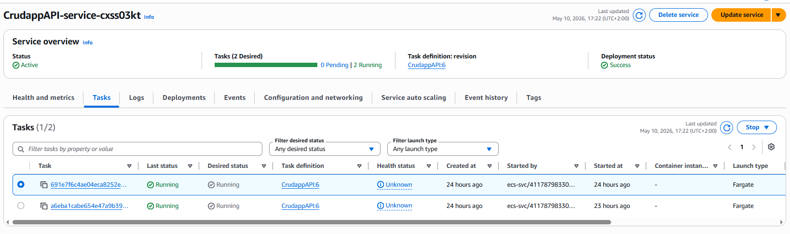
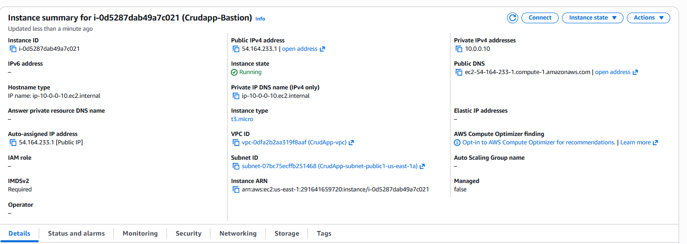

# CRUD App Infrastructure (AWS ECS + ECR + VPC)

> **Date:** 2026-05-10  
> **Owner:** Xandro-D

This guide walks through creating the VPC, security groups, ECR images, ECS cluster, task definitions, services, and a bastion host for debugging.  
**Note:** Keep the existing image URLs as-is. Suggestions for additional images are provided below each section.

---

## Overvieuw


## 1) Create the VPC

**Settings**

- **Name:** `crudApp`
- **IPv4 CIDR block:** `10.0.0.0/24`
- **Availability Zones:** `2` (for better reliability)
- **Public subnets:** `2`
- **Private subnets:** `4`  
  - 2 per AZ  
  - 1 for API, 1 for DB per AZ
- **NAT gateways:** `1 (regional)`
- **All other settings:** default

**Rename private subnets** for clarity (e.g., `private-api`, `private-db`, `private-api`, `private-db`).


---

## 2) Create Security Groups

Go to **VPC → Security groups → Create security group**.

### Front-end SG

**Name:** `FrontEnd`  
**VPC:** `crudlab`

**Inbound rules**

| Type | Protocol | Port | Source | Description |
|------|----------|------|--------|-------------|
| HTTP | TCP | 80 | 0.0.0.0/0 | Public web access |

---

### API SG

**Name:** `xd-CrudApp-API`  
**VPC:** `crudlab`

**Inbound rules**

| Type | Protocol | Port | Source | Description |
|------|----------|------|--------|-------------|
| Custom TCP | TCP | 8000 | `FrontEnd` security group | Allow frontend to API |

---

### Bastion SG

**Name:** `xd-bastion-sg`  
**VPC:** `crudlab`

**Inbound rules**

| Type | Protocol | Port | Source | Description |
|------|----------|------|--------|-------------|
| SSH | TCP | 22 | 0.0.0.0/0 | Admin access |

---

### Database SG

**Name:** `xd-crudapp-db-sg`  
**VPC:** `crudlab`

**Inbound rules**

| Type | Protocol | Port | Source | Description |
|------|----------|------|--------|-------------|
| PostgreSQL | TCP | 5432 | `xd-CrudApp-API` security group | API access |
| Custom TCP | TCP | 5322 | `xd-bastion-sg` security group | Bastion debugging |


---

## 3) Build and Push Docker Images to ECR

Go to **ECR → Create repository**.

### Backend image

**Repository name:** `xd-crudapp`

Follow the ECR push commands to build and push.

```dockerfile
# API Dockerfile

FROM python:3.11-slim
COPY requirements.txt requirements.txt
RUN pip install -r requirements.txt
COPY main.py main.py
COPY ./app ./app

ENV DATABASE_URL="sqlite:///./notetaker.db" \
    SECRET_KEY="change-me" \
    ACCESS_TOKEN_EXPIRE_MINUTES="120" \
    DEBUG="False"

EXPOSE 8000

ENTRYPOINT ["uvicorn", "main:app", "--host", "0.0.0.0", "--port", "8000", "--workers", "2"]
```

---

### Frontend image

Make sure to update the frontend API path to `/api`.

```dockerfile
FROM nginx
COPY ./ngnix.conf /etc/nginx/nginx.conf
COPY ./frontend ./usr/share/nginx/html

EXPOSE 80
```

**Nginx config**

```nginx
worker_processes 1;

events {
    worker_connections 1024;
}

http {
    include       /etc/nginx/mime.types;
    default_type  application/octet-stream;

    sendfile        on;
    keepalive_timeout  65;

    server {
        listen 80;
        server_name _;

        # Serve frontend static files
        root /usr/share/nginx/html;
        index index.html;

        location / {
            try_files $uri $uri/ /index.html;
        }

        # Proxy API calls to private backend
        location /api/ {
            proxy_pass http://internal-BackEndLoadBallancer2-1159648751.us-east-1.elb.amazonaws.com:8000/;
            proxy_set_header Host $host;
            proxy_set_header X-Real-IP $remote_addr;
            proxy_set_header X-Forwarded-For $proxy_add_x_forwarded_for;
        }
    }
}
```



---

## 4) Create an ECS Cluster

Go to **Amazon ECS → Create cluster**.

- **Name:** `xd-crudapp-api-cluster`
- **All other settings:** default



We use containers and Fargate for cost-effectiveness, scalability, and ease of updates.  
For updates, push the new image and redeploy the service.
---

## 5) Create ECS Task Definitions

Go to **Amazon ECS → Task definitions → Create new**.

### API Task

- **Name:** `CrudappAPI`
- **Task role:** `labrole`
- **Task execution role:** `labrole`
- **Container image:** `crudappapi`
- **Port mappings:** `8000`, `5432`


### Frontend Task

- **Name:** `CrudAppFrontEnd`
- **Task role:** `labrole`
- **Task execution role:** `labrole`
- **Container image:** `crudappapi`
- **Port mappings:** `80`, `8000`


**Suggested additional images:**
- Task definition container config
- Port mapping screen

---

## 6) Create Services

### Frontend Service

- **Task definition:** `CrudAppFrontEnd`
- **Platform version:** latest
- **Desired tasks:** 2
- **Availability Zone rebalancing:** enabled

**Networking**

- **VPC:** `curdapp`
- **Subnets:** public subnets
- **Security group:** `FrontEnd` (create if needed)

**Load balancing**

- **Create new load balancer**
  - **Name:** `FrontEndLoadBalancer`
  - **Target group:** `FrontEndGroup`

Now the frontend is reachable via the load balancer.

  


---

### Backend Service

#### Create Internal Load Balancer (before service)

Go to **EC2 → Load balancers → Create**.

- **Name:** *(your choice)*
- **Scheme:** Internal

**Network mapping**

- **VPC:** `Crudapp`
- **AZ & subnets:** select the two available

**Security groups**

- `xd-crudapp-api`

**Listeners and routing**

- **Port:** 8000  
- **Forward to group:** leave blank for now


---

#### Create Backend Service

- **Task definition:** `CruddAppAPI`
- **Platform version:** latest
- **Desired tasks:** 2
- **Availability Zone rebalancing:** enabled

**Networking**

- **VPC:** `curdapp`
- **Subnets:** private API subnets
- **Security group:** `xd-CrudApp-API`
- **Public IP:** off

**Load balancing**

- Select existing backend load balancer

Now the backend is reachable internally via the load balancer.


**Update Nginx config** to point to the internal API load balancer (already shown above).

---

### Update Backend Environment Variables

Change the backend environment variable to the RDS login string:

**Location:**  
`Aurora and RDS → Databases → xd-curdapp-db`

> **Important:** URL-encode the password to avoid errors.





---

## 7) Create a Bastion Host for Debugging

Go to **EC2 → Instances → Launch instance**.

- **Name:** `Crudapp-Bastion`
- **SSH key:** `labkey`

### AMI
Use the cheapest Ubuntu or preferred distro.

### Network settings

- **VPC:** `crudapp-VPC`
- **Subnet:** public subnet 1
- **Auto-assign public IP:** enabled
- **New security group**
  - **Name:** `XD-crudapp-Bastion`
  - **Description:** `XD-crudapp-Bastion`
  - **Inbound:** SSH (default)

All other settings: default.

---

## 8) Debugging from Bastion

Allow DB access from bastion by updating DB security group rules. (already shown)

Then ssh into the bastion and install AWS CLI + PostgreSQL client:

```bash
sudo apt install awscli
sudo apt install postgresql-client
```

```bash
export PGPASSWORD='<database password>'
psql "host=xd-curdapp-db.czxrhpm7aefl.us-east-1.rds.amazonaws.com \
port=5432 \
dbname=postgres \
user=postgres \
sslmode=require"

export PGPASSWORD='p92Yv)IC#467dzcE1$7$LuAkNM72'
```



## Changes to original code

Only two changes were made to the original code:
- Added `psycopg[binary]==3.1.18` to `requirements.txt` for PostgreSQL support.
- Updated the API base URL in the JavaScript file.

## Extra effort:
- Bastion server
- Docker images for all services (exept db)
- Fully integrated over 2 availibilty zones
- Implement load balancing for improved reliability and/or scalability
- Implement database replication for improved reliability and/or scalabilit
